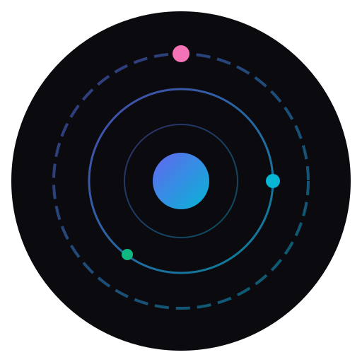

# 🌌 ORBIT - Game Library Manager

<p align="center">
  
</p>

<p align="center">
  <strong>El centro de gravedad de todos tus juegos</strong>
</p>

---

## 📖 Descripción

**ORBIT** es un gestor de biblioteca de juegos multiplataforma moderno y dinámico, inspirado en HydraLauncher. Unifica y organiza toda tu colección de juegos en una sola aplicación con una interfaz elegante y futurista.

## ✨ Características

### 🎮 Gestión de Biblioteca
- Agregar juegos manualmente
- Importar juegos de Steam, Epic Games, GOG, Minecraft
- Categorizar por género, desarrollador, estado
- Búsqueda y filtrado avanzado
- Sistema de etiquetas personalizadas
- Vista en grilla o lista

### 👤 Sistema de Perfiles
- Perfil personal con avatar
- Estadísticas detalladas
- Estado visible (jugando/disponible/ausente)
- Historial de actividad

### ☁️ Sincronización (Próximamente)
- Guardado en la nube
- Backup automático
- Sincronización entre dispositivos

### 🏆 Sistema de Logros (Próximamente)
- Rastreo de logros
- Galería de insignias
- Estadísticas por juego

### 🎨 Interfaz Moderna
- Tema espacial oscuro premium
- Animaciones suaves con Framer Motion
- Diseño responsivo
- Tema automático claro/oscuro

## 🛠️ Stack Tecnológico

- **Frontend**: React 19 + TypeScript
- **Build Tool**: Vite 7
- **Desktop**: Electron 39
- **Estado**: Zustand
- **Animaciones**: Framer Motion
- **Iconos**: Lucide React
- **Estilos**: CSS puro con variables personalizadas

## 🚀 Instalación

### Prerrequisitos
- Node.js 18+
- npm o yarn

### Pasos

```bash
# Clonar el repositorio
git clone <repo-url>
cd Orbit

# Instalar dependencias
npm install

# Iniciar en modo desarrollo (web)
npm run dev

# Iniciar con Electron
npm run electron:dev
```

## 📁 Estructura del Proyecto

```
Orbit/
├── electron/           # Proceso principal de Electron
│   └── main.js
├── public/             # Assets estáticos
│   └── orbit-icon.svg
├── src/
│   ├── components/     # Componentes reutilizables
│   │   ├── AddGameModal/
│   │   ├── GameCard/
│   │   ├── Sidebar/
│   │   └── TitleBar/
│   ├── pages/          # Páginas de la aplicación
│   │   ├── Dashboard/
│   │   ├── Library/
│   │   ├── Profile/
│   │   └── Settings/
│   ├── stores/         # Estado global (Zustand)
│   ├── types/          # Definiciones TypeScript
│   ├── App.tsx
│   ├── App.css
│   ├── main.tsx
│   └── index.css       # Sistema de diseño
├── package.json
├── vite.config.ts
└── README.md
```

## 🎯 Scripts Disponibles

| Script | Descripción |
|--------|-------------|
| `npm run dev` | Inicia el servidor de desarrollo Vite |
| `npm run build` | Compila la aplicación para producción |
| `npm run electron` | Ejecuta Electron (requiere build previo) |
| `npm run electron:dev` | Desarrollo con Electron + Hot Reload |
| `npm run electron:build` | Compila la app desktop |

## 🎨 Sistema de Diseño

ORBIT utiliza un sistema de diseño cohesivo basado en:

### Colores
- **Primario**: `#6366f1` (Indigo)
- **Secundario**: `#06b6d4` (Cyan)
- **Acento**: `#f472b6` (Pink)
- **Fondo**: `#0a0a0f` (Deep Space)

### Tipografía
- **Principal**: Inter
- **Monospace**: JetBrains Mono

## 📱 Páginas Disponibles

| Página | Estado | Descripción |
|--------|--------|-------------|
| Dashboard | ✅ | Vista principal con stats y juegos recientes |
| Biblioteca | ✅ | Gestión completa de juegos |
| Perfil | ✅ | Perfil de usuario y estadísticas |
| Configuración | ✅ | Ajustes de la aplicación |
| Catálogo | 🔄 | Explorar juegos disponibles |
| Logros | 🔄 | Sistema de achievements |
| Mods | 🔄 | Gestor de mods |
| Nube | 🔄 | Sincronización cloud |

## 🔧 Configuración

La aplicación guarda las preferencias usando `electron-store` con fallback a `localStorage` para desarrollo web:

- Tema (claro/oscuro/sistema)
- Idioma
- Notificaciones
- Sincronización automática
- Discord Rich Presence

## 📄 Licencia

MIT © ORBIT Team

---

<p align="center">
  Hecho con ❤️ para gamers
</p>
